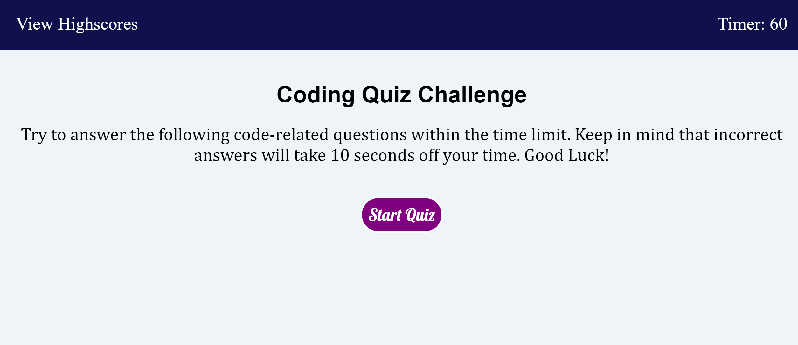

# Code-Quiz

For this project goal was to create a quiz with questions about coding. The quiz is timed, and if the user answers  question incorrectly, ten seconds is removed from the time. The project uses javascript click events, element query selectors, and local storage to get the useres input and store their information. There is a link for a highscores page that reads the local storage key and prints the user info. There is abutton to clear they scores and refresh the page once the quiz is over.   

Link: https://bac5806.github.io/Code-Quiz/
